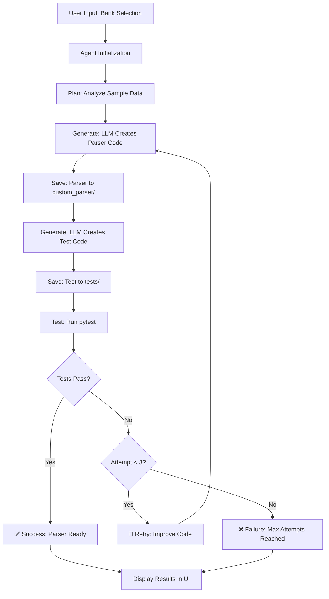

# AI Agent Bank Statement Parser Challenge

An autonomous AI agent that generates, tests, and refines bank statement parsers using LLM APIs. The agent follows a **Plan → Generate → Test → Fix** loop with up to 3 retry attempts.

## 🎥 Demo Video
Watch the full demo here: [Demo on Google Drive]([https://drive.google.com/file/d/XXXXXXXXXXXX/view?usp=sharing](https://drive.google.com/file/d/17ll1cn5CgPlfRT9ELgRJGLQsCOoJFed9/view?usp=drivesdk))

## 🏗️ Architecture



## 🚀 Quick Start (5 Steps)

### 1. Clone Repository
```bash
git clone <repository-url>
cd ai-agent-challenge
```

### 2. Install Dependencies
```bash
pip install -r requirements.txt
```

### 3. Set Up API Keys
Choose one of the following LLM providers and set the API key:

**OpenAI:**
```bash
export OPENAI_API_KEY="your-openai-api-key"
```

**Google Gemini:**
```bash
export GEMINI_API_KEY="your-gemini-api-key"
```

**Groq:**
```bash
export GROQ_API_KEY="your-groq-api-key"
```

### 4. Run Agent (CLI)
```bash
python agent.py --target icici --provider openai
```

### 5. Run Streamlit App
```bash
streamlit run app.py
```

## 📁 Project Structure

```
ai-agent-challenge/
├── agent.py                 # Main agent entry point
├── app.py                   # Streamlit UI application
├── requirements.txt         # Python dependencies
├── README.md               # This file
├── custom_parser/          # Generated parser modules
│   └── icici_parser.py     # Sample ICICI parser
├── tests/                  # Test modules
│   └── test_icici_parser.py # Sample ICICI tests
└── data/                   # Sample data
    └── icici/
        ├── icici sample.pdf # Sample PDF statement
        └── result.csv       # Expected output CSV
```

## 🎯 Features

### Agent Capabilities
- **Autonomous Operation**: Self-correcting loop with up to 3 retry attempts
- **Multi-LLM Support**: OpenAI, Gemini, and Groq integration
- **Intelligent Code Generation**: Context-aware parser creation
- **Automated Testing**: pytest integration with detailed reporting
- **Error Recovery**: Learns from failures and improves code

### Code Quality
- **Type Hints**: Full typing support for better maintainability
- **Comprehensive Docstrings**: Detailed documentation for all functions
- **Modular Design**: Clean separation of concerns
- **Error Handling**: Robust exception handling throughout

### User Interface
- **Streamlit Web App**: Modern, responsive UI
- **Data Visualization**: Interactive DataFrame display
- **Bank Selection**: Easy target bank switching

## 🔧 Usage

### Command Line Interface

```bash
# Basic usage
python agent.py --target icici

# Specify LLM provider
python agent.py --target sbi --provider gemini

# Provide API key directly
python agent.py --target hdfc --provider openai --api-key your-key

# Override sample data paths (useful for new banks without adding files to repo)
python agent.py \
  --target sbi \
  --provider gemini \
  --pdf "C:/path/to/SBI Statement.pdf" \
  --csv "C:/path/to/sbi_result.csv"

# Quick 5-step run example for a new bank using custom paths
python agent.py \
  --target new_bank \
  --provider gemini \
  --pdf "C:/path/to/new_bank sample.pdf" \
  --csv "C:/path/to/new_bank_result.csv"
```

### Web Interface

1. Start the Streamlit app: `streamlit run app.py`
2. Select your target bank from the dropdown
{{ ... }}
3. **Architecture** (20%): Clear design patterns, reusable functions, maintainable code
4. **Demo Performance** (10%): <60 second fresh run, agent works and pytest passes

## 🛠️ Development

### Adding New Banks

1. Add sample data to `data/{bank_name}/`
2. Include both PDF and expected CSV files
3. Follow the naming convention: `{bank_name} sample.pdf` and `result.csv`

Or, skip adding files to the repository and use path overrides via CLI:


### Customizing Parser Logic

The generated parsers use:
- **pdfplumber** for PDF text extraction
- **regex patterns** for transaction parsing
- **pandas** for data manipulation
- **datetime** for date handling

## 🐛 Troubleshooting

### Common Issues

**API Key Not Found:**
```bash
# Set environment variable
export OPENAI_API_KEY="your-key"

# Or provide directly
python agent.py --target icici --api-key your-key
```

**PDF Parsing Errors:**
- Ensure PDF is text-based (not scanned image)
- Check PDF file permissions
- Verify file path is correct

**Test Failures:**
- Check sample data format matches expected columns
- Verify date format consistency
- Ensure numeric columns are properly formatted

**Import Errors:**
```bash
# Install missing dependencies
pip install -r requirements.txt

# Check Python path
export PYTHONPATH="${PYTHONPATH}:$(pwd)"
```

## 📈 Performance Optimization

- **Lightweight Parsing**: Uses pdfplumber for fast PDF processing
- **Cached Results**: Test results cached when possible
- **Code Size Limit**: Generated parsers kept under 100 lines
- **Timeout Handling**: 5-minute timeout for long-running operations
- **Parallel Processing**: Multiple operations run concurrently where possible

## 🤝 Contributing

1. Fork the repository
2. Create a feature branch
3. Make your changes
4. Add tests for new functionality
5. Submit a pull request

## 📄 License

This project is licensed under the MIT License - see the LICENSE file for details.

## 🙏 Acknowledgments

- **pdfplumber** for PDF text extraction
- **pandas** for data manipulation
- **pytest** for testing framework
- **Streamlit** for web interface
- **OpenAI/Gemini/Groq** for LLM capabilities

---

**Built with ❤️ by AI Agent Challenge**
