# AI Agent Bank Statement Parser Challenge

An autonomous AI agent that generates, tests, and refines bank statement parsers using LLM APIs. The agent follows a **Plan → Generate → Test → Fix** loop with up to 3 retry attempts.

## 🎥 Demo Video
Watch the full demo here: [Demo on Google Drive]([https://drive.google.com/file/d/XXXXXXXXXXXX/view?usp=sharing](https://drive.google.com/file/d/17ll1cn5CgPlfRT9ELgRJGLQsCOoJFed9/view?usp=drivesdk))

## 🏗️ Architecture

```mermaid
graph TD
    A[User Input: Bank Selection] --> B[Agent Initialization]
    B --> C[Plan: Analyze Sample Data]
    C --> D[Generate: LLM Creates Parser Code]
    D --> E[Save: Parser to custom_parser/]
    E --> F[Generate: LLM Creates Test Code]
    F --> G[Save: Test to tests/]
    G --> H[Test: Run pytest]
    H --> I{Tests Pass?}
    I -->|Yes| J[✅ Success: Parser Ready]
    I -->|No| K{Attempt < 3?}
    K -->|Yes| L[🔄 Retry: Improve Code]
    L --> D
    K -->|No| M[❌ Failure: Max Attempts Reached]
    J --> N[Display Results in UI]
    M --> N
```



## 🚀 Quick Start (5 Steps)

### 1. Clone Repository
```bash
git clone <repository-url>
cd ai-agent-challenge
```

### 2. Install Dependencies
```bash
pip install -r requirements.txt
```

### 3. Set Up API Keys
Choose one of the following LLM providers and set the API key:

**OpenAI:**
```bash
export OPENAI_API_KEY="your-openai-api-key"
```

**Google Gemini:**
```bash
export GEMINI_API_KEY="your-gemini-api-key"
```

**Groq:**
```bash
export GROQ_API_KEY="your-groq-api-key"
```

### 4. Run Agent (CLI)
```bash
python agent.py --target icici --provider openai
```

### 5. Run Streamlit App
```bash
streamlit run app.py
```

## 📁 Project Structure

```
ai-agent-challenge/
├── agent.py                 # Main agent entry point
├── app.py                   # Streamlit UI application
├── requirements.txt         # Python dependencies
├── README.md               # This file
├── custom_parser/          # Generated parser modules
│   └── icici_parser.py     # Sample ICICI parser
├── tests/                  # Test modules
│   └── test_icici_parser.py # Sample ICICI tests
└── data/                   # Sample data
    └── icici/
        ├── icici sample.pdf # Sample PDF statement
        └── result.csv       # Expected output CSV
```

## 🎯 Features

### Agent Capabilities
- **Autonomous Operation**: Self-correcting loop with up to 3 retry attempts
- **Multi-LLM Support**: OpenAI, Gemini, and Groq integration
- **Intelligent Code Generation**: Context-aware parser creation
- **Automated Testing**: pytest integration with detailed reporting
- **Error Recovery**: Learns from failures and improves code

### Code Quality
- **Type Hints**: Full typing support for better maintainability
- **Comprehensive Docstrings**: Detailed documentation for all functions
- **Modular Design**: Clean separation of concerns
- **Error Handling**: Robust exception handling throughout

### User Interface
- **Streamlit Web App**: Modern, responsive UI
- **Real-time Logs**: Live progress tracking
- **Data Visualization**: Interactive DataFrame display
- **Bank Selection**: Easy target bank switching

## 🔧 Usage

### Command Line Interface

```bash
# Basic usage
python agent.py --target icici

# Specify LLM provider
python agent.py --target sbi --provider gemini

# Provide API key directly
python agent.py --target hdfc --provider openai --api-key your-key
```

### Web Interface

1. Start the Streamlit app: `streamlit run app.py`
2. Select your target bank from the dropdown
3. Choose your preferred LLM provider
4. Enter API key (or use environment variable)
5. Click "Run AI Agent" to start the process
6. View real-time logs and results

## 🧪 Testing

The agent automatically generates and runs comprehensive tests:

```bash
# Run tests manually
pytest tests/ -v

# Run specific bank tests
pytest tests/test_icici_parser.py -v
```

### Test Coverage
- File existence validation
- DataFrame structure verification
- Data type checking
- Data accuracy comparison with expected CSV
- Error handling for edge cases

## 📊 Sample Data Format

The parser expects bank statements in PDF format and generates DataFrames with these columns:

| Column | Type | Description |
|--------|------|-------------|
| Date | datetime | Transaction date (DD-MM-YYYY) |
| Description | string | Transaction description |
| Debit | float | Debit amount (if applicable) |
| Credit | float | Credit amount (if applicable) |
| Balance | float | Account balance after transaction |

## 🔄 Agent Loop Details

### 1. Plan Phase
- Analyzes sample CSV data to understand expected format
- Identifies column structure and data types
- Prepares context for LLM code generation

### 2. Generate Phase
- Uses LLM to create parser code based on sample data
- Generates comprehensive test suite
- Ensures code follows best practices and requirements

### 3. Test Phase
- Runs pytest on generated code
- Validates against sample data
- Captures detailed test output and errors

### 4. Fix Phase (if needed)
- Analyzes test failures
- Generates improved code based on error analysis
- Retries up to 3 times with learning from previous attempts

## 🎯 Evaluation Priorities

1. **Agent Autonomy** (40%): Self-correcting loop, max 3 attempts, minimal human intervention
2. **Code Quality** (30%): Typing, docstrings, modular design, clean architecture
3. **Architecture** (20%): Clear design patterns, reusable functions, maintainable code
4. **Demo Performance** (10%): <60 second fresh run, agent works and pytest passes

## 🛠️ Development

### Adding New Banks

1. Add sample data to `data/{bank_name}/`
2. Include both PDF and expected CSV files
3. Follow the naming convention: `{bank_name} sample.pdf` and `result.csv`

### Extending LLM Providers

1. Add provider to `BankParserAgent._init_llm_client()`
2. Update `generate_parser_code()` and `generate_test_code()` methods
3. Add provider to CLI arguments and Streamlit UI

### Customizing Parser Logic

The generated parsers use:
- **pdfplumber** for PDF text extraction
- **regex patterns** for transaction parsing
- **pandas** for data manipulation
- **datetime** for date handling

## 🐛 Troubleshooting

### Common Issues

**API Key Not Found:**
```bash
# Set environment variable
export OPENAI_API_KEY="your-key"

# Or provide directly
python agent.py --target icici --api-key your-key
```

**PDF Parsing Errors:**
- Ensure PDF is text-based (not scanned image)
- Check PDF file permissions
- Verify file path is correct

**Test Failures:**
- Check sample data format matches expected columns
- Verify date format consistency
- Ensure numeric columns are properly formatted

**Import Errors:**
```bash
# Install missing dependencies
pip install -r requirements.txt

# Check Python path
export PYTHONPATH="${PYTHONPATH}:$(pwd)"
```

## 📈 Performance Optimization

- **Lightweight Parsing**: Uses pdfplumber for fast PDF processing
- **Cached Results**: Test results cached when possible
- **Code Size Limit**: Generated parsers kept under 100 lines
- **Timeout Handling**: 5-minute timeout for long-running operations
- **Parallel Processing**: Multiple operations run concurrently where possible

## 🤝 Contributing

1. Fork the repository
2. Create a feature branch
3. Make your changes
4. Add tests for new functionality
5. Submit a pull request

## 📄 License

This project is licensed under the MIT License - see the LICENSE file for details.

## 🙏 Acknowledgments

- **pdfplumber** for PDF text extraction
- **pandas** for data manipulation
- **pytest** for testing framework
- **Streamlit** for web interface
- **OpenAI/Gemini/Groq** for LLM capabilities

---

**Built with ❤️ by AI Agent Challenge**
